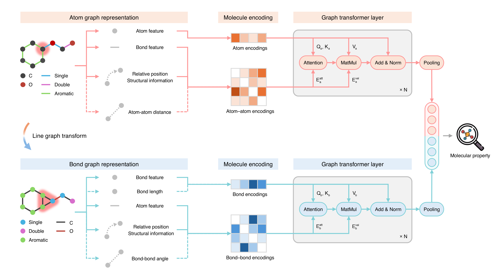

# Dual Graph Transformer for Molecular Property Prediction

This repo is the implementation of the dual graph transformer for molecular property prediction.
This model leverages the integration of atom and bond graphs for encoding comprehensive molecular information, including atom and bond features, graph topology and structure, and 3D spatial information if available, to enhance the prediction performance.



To install, run the following commands in sequence
```
conda create -n dgt python=3.10.16
conda activate dgt
conda install mamba
mamba install graph-tool==2.45
pip install torch==2.1.0 torchvision==0.16.0 torchaudio==2.1.0
pip install pyg_lib torch_scatter torch_sparse torch_cluster torch_spline_conv -f https://data.pyg.org/whl/torch-2.1.0+cu121.html
pip install torch-geometric==2.0.4
pip install torchmetrics==1.2.0
pip install ogb==1.3.6
pip install tensorboardX==2.6.2.2
pip install wandb==0.18.7
pip install rdkit==2025.9.1
pip install libauc==1.1.0
```

Since molecular SMILES is not provided along with the the download link of `torch_geometric` for the QM9 dataset. We provide that together with the scaffold splitting result in the `datasets/QM9_split` folder. After downloading the QM dataset, please run all files under `datasets/QM9_split` to `datasets/QM9/raw`.  

Configuration files for reproducing our results are provided in the `configs` folder.  
To train from scratch, run `python main.py --cfg config_file_path --repeat 1 seed 0 wandb.use False`.  
This implementation is developed from graphgps. For more information, please check